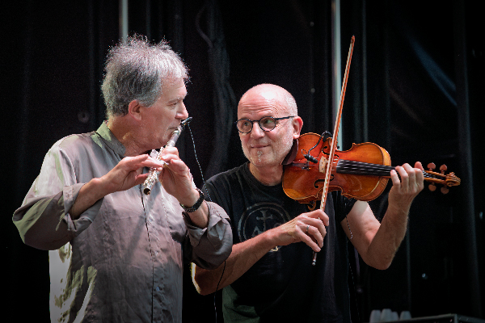

# jmlfoto · Web personal Jose Morales
## Guía de estructura, archivos e instrucciones

---

## Estructura completa de carpetas

```
jmlfoto-web/
│
├── index.html              ← Página principal
├── style.css               ← Estilos
├── script.js               ← Interacciones
├── privacidad.html         ← Política de privacidad (opcional)
├── aviso-legal.html        ← Aviso legal (opcional)
├── README.md               ← Esta guía
│
└── assets/
    └── img/
        │
        │── HERO (slideshow)
        ├── hero-01.jpg     1920×1080 px · Concierto, Vincent de Gwendal
        ├── hero-02.jpg     1920×1080 px · Naturaleza, seta
        ├── hero-03.jpg     1920×1080 px · Retrato de Ángela
        ├── hero-04.jpg     1920×1080 px · Modelo en campo de Lavanda
        │
        │── SOBRE MÍ
        ├── retrato.jpg     600×800 px  · Foto mía de Ortigueira, autora: María formato vertical
        │
        │── PORTFOLIO
        ├── portfolio-conciertos.jpg   800×600 px · Foto horizontal
        ├── portfolio-naturaleza.jpg   800×600 px · Foto horizontal
        ├── portfolio-patrimonio.jpg   800×600 px · Foto horizontal
        ├── portfolio-dron.jpg         800×600 px · Foto horizontal
        │
        │── PROYECTO GWENDAL
        ├── proyecto-gwendal.jpg       800×1000 px · Foto vertical
        │
        │── BLOG (actualizar con cada nueva entrada)
        ├── blog-01.jpg     600×400 px · Foto entrada más reciente
        ├── blog-02.jpg     600×400 px · Foto segunda entrada
        ├── blog-03.jpg     600×400 px · Foto tercera entrada
        │
        │── COPIAS
        ├── copias.jpg      800×1000 px · Foto vertical, ejemplo de copia
        │
        └── REDES SOCIALES
            og-jmlfoto.jpg  1200×630 px · Preview al compartir en redes
```

---

## Cómo publicar en GitHub Pages

1. Crea un repositorio en GitHub llamado `jmlfoto`
2. Sube todos los archivos manteniendo esta estructura de carpetas
3. Ve a **Settings → Pages**
4. En Branch selecciona `main` y carpeta `/ (root)`
5. Clic en **Save**
6. Tu web estará en: `https://jmlfoto-gw.github.io/jmlfoto/`

---

## Cómo añadir imágenes reales

### Hero (slideshow)
Las imágenes van referenciadas en el HTML como `background-image`:
```html
<div class="hero-slide active"
     style="background-image: url('assets/img/hero-01.jpg')"></div>
```
Solo tienes que subir los archivos con esos nombres exactos.

### Portfolio
Busca en index.html el bloque `.port-img` y sustituye el div placeholder:
```html
<!-- Antes -->
<div class="img-ph">...</div>

<!-- Después -->

```

Añade en style.css:
```css
.port-img img {
  width: 100%;
  height: 100%;
  object-fit: cover;
  transition: transform var(--t-slow);
}
.port-item:hover .port-img img { transform: scale(1.04); }
```

### Blog
Busca cada `.blog-img` y sustituye el placeholder:
```html
<!-- Antes -->
<div class="img-ph">...</div>

<!-- Después -->

```

Añade en style.css:
```css
.blog-img img {
  width: 100%;
  height: 100%;
  object-fit: cover;
  transition: transform var(--t-slow);
}
.blog-link:hover .blog-img img { transform: scale(1.05); }
```

---

## Cómo actualizar el blog

Cada vez que publiques una entrada nueva en WordPress:

1. Abre `index.html`
2. Busca `<div class="blog-lista">`
3. Copia un `<article class="blog-item">` existente
4. Pégalo al principio de la lista (será la entrada más reciente)
5. Actualiza estos cuatro datos:

```html
<article class="blog-item reveal">
  <a href="https://jmlfoto.es/TU-NUEVA-URL"   ← URL de WordPress
     ...>
    <div class="blog-img">
       ← foto nueva
    </div>
    <div class="blog-body">
      <span class="blog-cat">Conciertos</span> ← categoría
      <time datetime="2026-06-01">1 junio 2026</time> ← fecha
      <h3>Título de la entrada</h3>             ← título
      <p>Extracto breve...</p>                  ← extracto
    </div>
  </a>
</article>
```

6. Elimina el `<article>` más antiguo para mantener solo 3 entradas
7. Sube el `index.html` actualizado a GitHub

---

## Formulario de contacto

Conectado a Formspree. Para activarlo:
1. Entra en https://formspree.io
2. Crea un formulario llamado `Contacto jmlfoto`
3. En index.html busca `action="https://formspree.io/f/mlgkekrd"`
4. Sustitúyelo por tu nuevo código

---

## Datos a personalizar en index.html

| Qué | Dónde buscarlo |
|---|---|
| Email de contacto | `href="mailto:jose@jmlfoto.es"` |
| URL Instagram | `href="https://www.instagram.com/jmlfoto"` |
| URL Facebook | `href="https://www.facebook.com/jmlfoto"` |
| URL Twitter/X | `href="https://twitter.com/jmlfoto"` |
| URL YouTube | `href="https://www.youtube.com/@jmlfoto-es"` |
| URL tienda copias | `href="https://photo-portal.shop/..."` |
| URL web Gwendal | `href="https://jmlfoto-gw.github.io/gwendalceltic/"` |
| canonical y og:url | En el `<head>`, actualizar con URL real |

---

## Compatibilidad

- Chrome / Edge 88+
- Firefox 85+
- Safari 14+
- iOS Safari · Chrome Android
- Sin dependencias externas salvo Google Fonts
